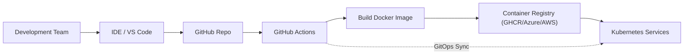

# Pipeline GitOps intégrant DevOps

Ce dépôt propose un exemple minimaliste pour comprendre comment enchaîner développement, CI/CD et déploiement GitOps d'une application conteneurisée. Il reprend le flux illustré ci-dessous et fournit tout le nécessaire pour démarrer rapidement : code d'exemple, Dockerfile, manifests Kubernetes et workflow GitHub Actions.



## Structure du dépôt
- `app/` : micro-service HTTP ultra simple servant une réponse JSON.
  - `app/Dockerfile` : image Python 3.11 sans dépendances externes.
  - `app/src/main.py` : serveur HTTP renvoyant `/` et `/health`.
- `k8s/` : manifests Kubernetes (Deployment, Service, Kustomization).
- `.github/workflows/ci-cd.yaml` : pipeline CI/CD GitHub Actions qui construit/publie l'image et applique les manifests.

## Flux détaillé
1. **Développement** : une contribution est poussée sur le repo GitHub.
2. **CI** : GitHub Actions vérifie que le code Python compile, construit l'image Docker et la publie dans GHCR (ou tout autre registre compatible OCI).
3. **CD GitOps** :
   - Le workflow applique les manifests Kubernetes (ou un opérateur GitOps type Argo CD/Flux se synchronise sur le répertoire `k8s/`).
   - Kubernetes déploie la nouvelle image et réalise un `rollout` contrôlé.

## Mise en route rapide
### 1) Lancer l'app en local
```bash
# Depuis la racine du dépôt
python app/src/main.py
# ou via Docker
cd app
docker build -t gitops-devops-pipeline .
docker run --rm -p 8080:8080 gitops-devops-pipeline
curl http://localhost:8080/health
```

### 2) Préparer votre registre d'images
- Par défaut, le workflow utilise GitHub Container Registry (`ghcr.io`).
- Ajustez `IMAGE_NAME` dans `.github/workflows/ci-cd.yaml` si vous préférez Azure Container Registry ou Amazon ECR.

### 3) Secrets à configurer dans GitHub Actions
- `KUBECONFIG_BASE64` : kubeconfig encodé en base64 avec les droits de déploiement (namespace cible inclus).
- Facultatif : si vous utilisez un registre privé autre que GHCR, ajoutez `REGISTRY_USERNAME`/`REGISTRY_PASSWORD` et adaptez l'étape de login.

### 4) Déployer sur un cluster Kubernetes
```bash
kubectl apply -k k8s
kubectl rollout status deployment/gitops-devops-pipeline --timeout=120s
kubectl get svc gitops-devops-pipeline
```

## Notes d'implémentation
- L'application écoute sur le port 8080 et expose les endpoints `/` et `/health`.
- Les probes Kubernetes sont alignées sur ces routes afin de sécuriser les mises à jour progressives.
- Les ressources demandent/limitent légèrement CPU et mémoire pour faciliter le scheduling sur la plupart des clusters.

## Aller plus loin
- Remplacer l'image de démonstration par votre image applicative.
- Brancher un opérateur GitOps (Argo CD, FluxCD, ou Octopus Deploy si vous l'utilisez) pour déclencher des synchros automatiques.
- Ajouter des tests applicatifs et des scans de sécurité (SAST/Container scan) dans le job `build-and-test`.
